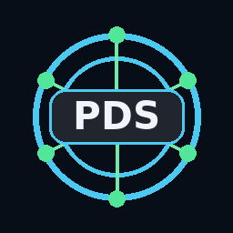
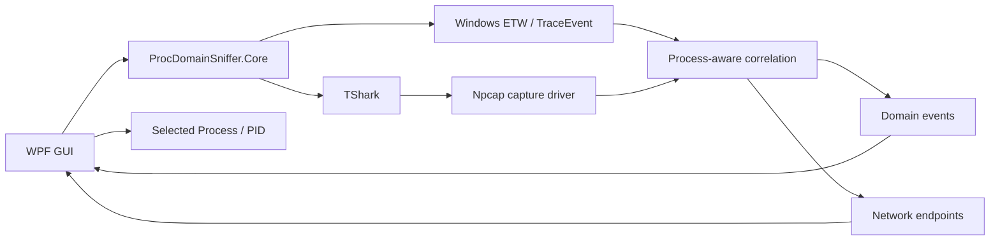
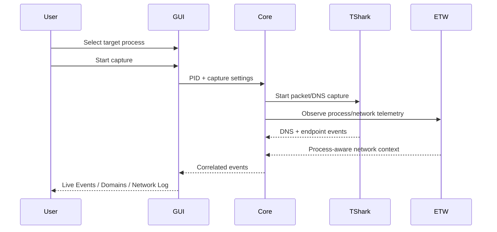

# ProcDomainSniffer

<p align="center">
  
</p>

<h3 align="center">Process-aware domain & network telemetry for Windows</h3>

<p align="center">
  Observe the domains and network endpoints associated with a selected Windows process through a native .NET 8 / WPF interface.
</p>

<p align="center">
  
  
  
  
</p>
<p align="center">
  <a href="https://github.com/Danial-Zolfaghari/ProcDomainSniffer/actions/workflows/build.yml"></a>
  <a href="https://github.com/Danial-Zolfaghari/ProcDomainSniffer/releases"></a>
  <a href="LICENSE"></a>
</p>


---

## Overview

**ProcDomainSniffer** is a native Windows desktop application for correlating a selected process with observed DNS/domain activity and network endpoints.

It combines process selection, capture telemetry, DNS observations, resolved IP tracking, network-flow summaries, filtering, activity logs, and export/copy workflows in one desktop workspace.

## Architecture



## Main workspace

The GUI is split into focused tabs:

- **Target Application** — process selection and PID/path details
- **Capture Settings** — capture behavior and interface controls
- **Overview** — active capture state and high-level counters
- **Live Events** — timestamped domain events
- **Domain Summary** — aggregated domain observations
- **Domain + IP** — resolved public IP addresses per observed domain
- **Network Log** — source/destination endpoint telemetry
- **Activity Log** — operational messages and capture status

## Features

- Process-aware capture workflow
- Windows process enumeration
- PID-targeted telemetry correlation
- DNS/domain observation
- Domain aggregation and occurrence counters
- Domain-to-public-IP resolution view
- Network endpoint log
- Protocol and destination-port visibility
- Capture-interface selection
- Loopback/internal-traffic filtering controls
- Search/filter controls across views
- Copy/export-oriented workflows
- Native dark WPF interface
- Single-file self-contained Windows build
- No environment-specific private IP ranges hard-coded in the public build

## Capture pipeline



## Platform support

| Platform | Support | Notes |
|---|---|---|
| Windows 10/11 x64 | ✅ Full | WPF + ETW + Npcap/TShark |
| Linux | ❌ Not supported | Current GUI/correlation layer uses Windows WPF/ETW |
| macOS | ❌ Not supported | Current GUI/correlation layer uses Windows WPF/ETW |

## Runtime requirements

### Required on the target Windows machine

- Windows 10 or Windows 11 x64
- **Wireshark / TShark** installed
- **Npcap** installed and available to TShark
- Administrator privileges are recommended/required for packet capture depending on the local Npcap configuration

### Build requirements

- .NET **8 SDK**
- PowerShell 5.1+ or PowerShell 7+
- Internet access during restore for NuGet packages

The core project restores:

```text
Microsoft.Diagnostics.Tracing.TraceEvent 3.2.6
```

## Build

From the repository root:

```powershell
.\build-gui.ps1
```

The script:

1. Restores the .NET projects for `win-x64`
2. Publishes a self-contained Release build
3. Produces a single executable
4. Removes extra publish artifacts from the final output folder

Final output:

```text
output/ProcDomainSniffer.GUI.exe
```

The published executable is self-contained, so the target machine does not need a separate .NET runtime installation. **TShark + Npcap are still runtime dependencies.**

## Build manually

```powershell
dotnet restore .\ProcDomainSniffer.GUI\ProcDomainSniffer.GUI.csproj -r win-x64

dotnet publish .\ProcDomainSniffer.GUI\ProcDomainSniffer.GUI.csproj `
  -c Release `
  -r win-x64 `
  --self-contained true `
  -p:PublishSingleFile=true `
  -p:PublishTrimmed=false
```

## Project structure

```text
ProcDomainSniffer/
├─ ProcDomainSniffer.Core/
│  ├─ DomainSnifferService.cs
│  ├─ SnifferContracts.cs
│  └─ ProcDomainSniffer.Core.csproj
├─ ProcDomainSniffer.GUI/
│  ├─ Assets/
│  │  ├─ ProcDomainSniffer.ico
│  │  └─ ProcDomainSnifferIcon.png
│  ├─ Models/
│  │  └─ UiModels.cs
│  ├─ App.xaml
│  ├─ App.xaml.cs
│  ├─ MainWindow.xaml
│  ├─ MainWindow.xaml.cs
│  └─ ProcDomainSniffer.GUI.csproj
├─ build-gui.ps1
├─ REQUIREMENTS.md
└─ README.md
```

## Privacy & scope

ProcDomainSniffer works with local process/network telemetry. Captures can contain sensitive operational information such as hostnames, destination IP addresses and process paths.

Before sharing captures or screenshots:

- redact internal domains
- redact private infrastructure addresses when necessary
- redact usernames embedded in process paths
- avoid committing capture exports or logs containing environment-specific data

## Responsible use

Use packet/process monitoring only on systems and networks you own or are explicitly authorized to inspect.

## Author

**Danial Zolfaghari**  
GitHub: [@Danial-Zolfaghari](https://github.com/Danial-Zolfaghari)

---

## Author

**Danial Zolfaghari** — [@Danial-Zolfaghari](https://github.com/Danial-Zolfaghari)

