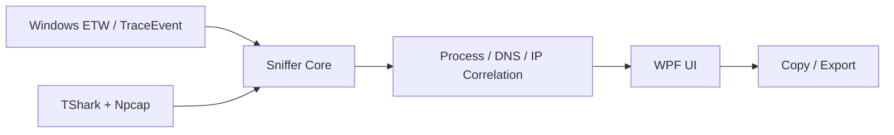

# ProcDomainSniffer

<p align="center"><strong>Per-process domain and network visibility for Windows</strong></p>

<p align="center">
  
  
  
  
</p>

## Overview
ProcDomainSniffer is a native Windows desktop application that correlates process activity with observed domains, DNS answers and network endpoints. It combines ETW/TraceEvent process context with packet-level data from TShark/Npcap and presents the result in a searchable WPF interface.

## Supported platforms
| Platform | Support | Notes |
|---|---:|---|
| Windows 10/11 x64 | ✅ | Primary target; required for WPF + ETW |
| Linux | ❌ | WPF/ETW implementation is Windows-specific |
| macOS | ❌ | WPF/ETW implementation is Windows-specific |

## Architecture


## Features
- Per-process observation view
- Domain, IP and network tabs
- DNS answer correlation
- Process metadata and endpoint context
- Filtering and search
- Copy/export workflows
- Native WPF desktop UI
- Self-contained Windows x64 publish
- No network-specific private-range heuristics in the public build

## Requirements
### Runtime
- Windows 10/11 x64
- Npcap with packet-capture support
- Wireshark/TShark
- Administrator privileges may be required depending on capture configuration

### Build
- .NET 8 SDK
- PowerShell

NuGet dependency:
- `Microsoft.Diagnostics.Tracing.TraceEvent` 3.2.6

## Build
```powershell
./build-gui.ps1
```

## Project layout
```text
ProcDomainSniffer/
├─ ProcDomainSniffer.Core/
├─ ProcDomainSniffer.GUI/
│  ├─ Models/
│  ├─ App.xaml
│  ├─ MainWindow.xaml
│  └─ MainWindow.xaml.cs
└─ build-gui.ps1
```

## Privacy and scope
Packet/process data can reveal sensitive hostnames and infrastructure. Exported observations should be treated as sensitive operational data. The public repository contains no environment-specific sinkhole addresses, credentials or API tokens.

Use only on systems and networks you own or are authorized to inspect.

## Author
**Danial Zolfaghari** — [@Danial-Zolfaghari](https://github.com/Danial-Zolfaghari)
